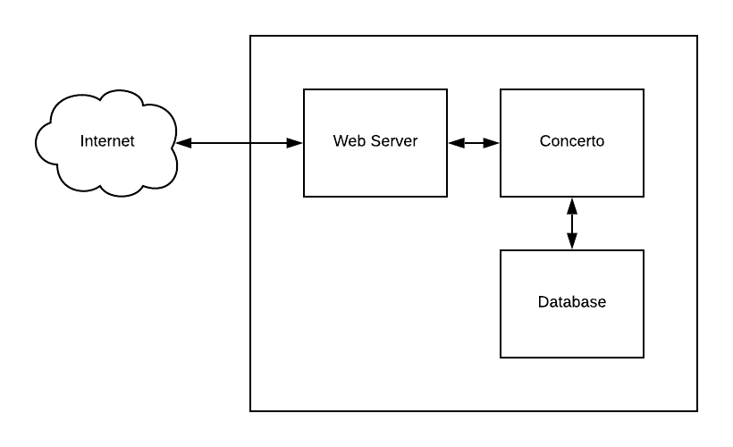
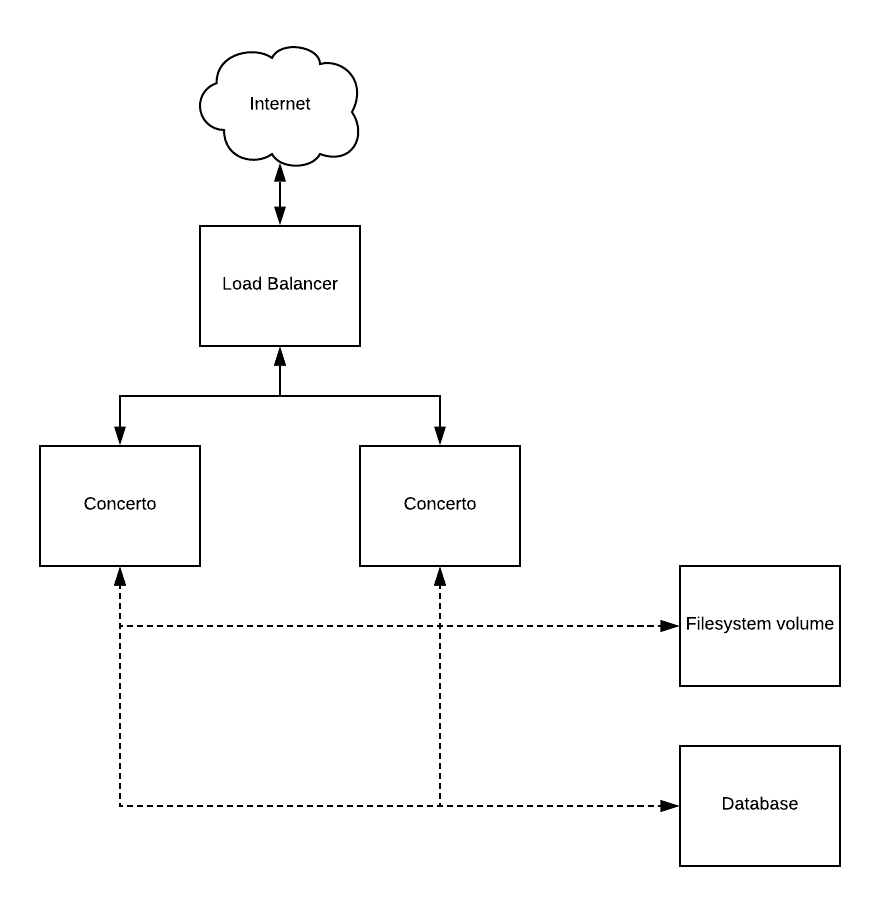
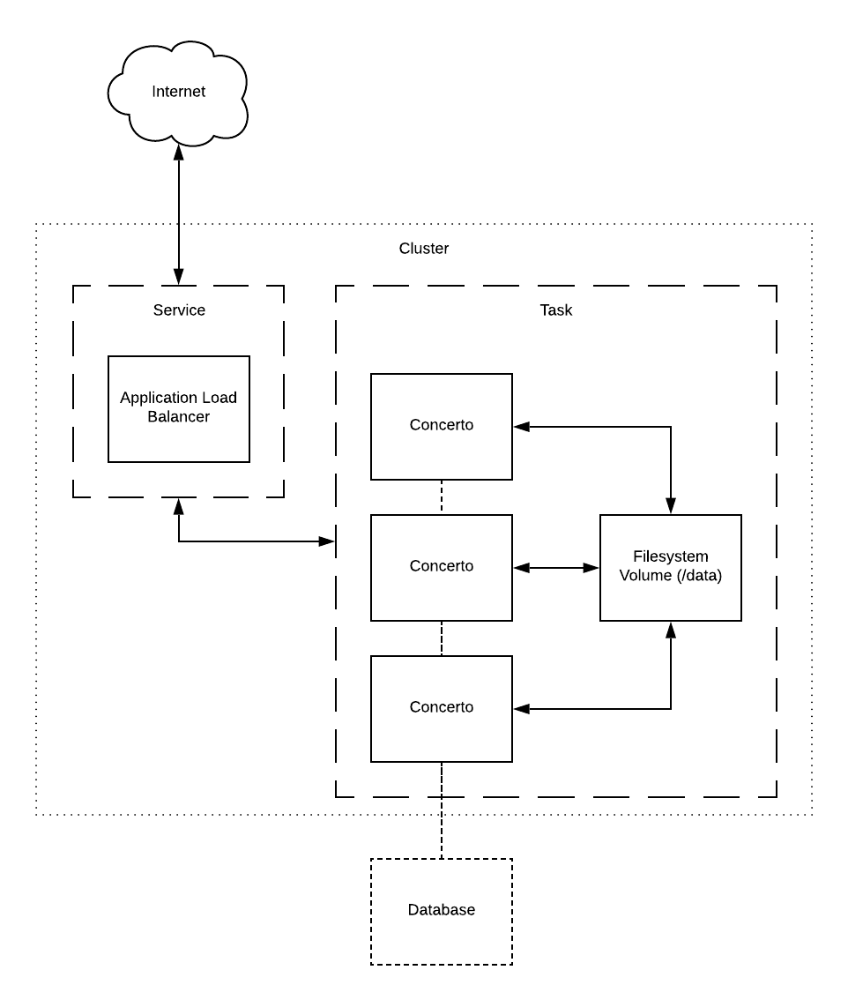
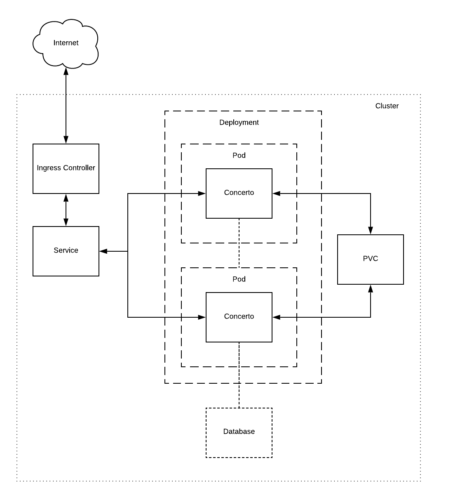

Concerto Deployment Guide
=========================

Build process and versioning
============================

Concerto is an open-source online adaptive test development platform and
its source code repository is hosted on GitHub
\[<https://github.com/campsych/concerto-platform>\]. The project's issue
tracker and wiki can also be found there. The 'master' branch reflects
the most up-to-date version of the source code.

Each released version has a corresponding tag. Our versioning strategy
is XX.YY.ZZ, where XX and YY are considered major iterations, with
possible breaking changes between them, and ZZ are minor incremental
changes.

Any changes committed to the source code repository trigger a build
process on Travis \[<https://travis-ci.org/campsych/concerto-platform>\]
where it can be tracked.

A successful build process will result in the creation of a Docker
container that is hosted and can be pulled from Docker Hub
\[<https://hub.docker.com/r/campsych/concerto-platform>\]. The
containers are tagged by version number, which corresponds to a tag in
the source code repository.

The 'latest' tag always points to the latest build on master branch,
which is a development branch, so we would not recommend using it in
production. It is best practice to freeze to a specific minor version
tag and update it whenever needed.

Overview
--------

### Requirements

Concerto is a standard PHP-based web application that can run on Linux,
MacOS and Windows. It can therefore run on any architecture where PHP is
supported (x86, x86\_64, arm).

Concerto can communicate with the following databases through its
database abstraction layer: MySQL, MariaDB, PostgreSQL, Microsoft SQL
Server, SQLite, Oracle, Firebird.

### Limitations of Docker container provided by us

The Docker container supplied by us only supports x86\_64 architecture
and contains drivers for MySQL and MariaDB databases. If you require
Concerto to run in a container on a different architecture it is
possible to create a custom Dockerfile and build a container similarly
to how we build it on Travis.

Configuration
-------------

Concerto configuration files can be found in `./app/config` and the ones
to look for are `parameters.yml` and `parameters_runner.yml`. Most values
are either self-explanatory or commented.

The most common settings in configuration files can be overridden by
environment variables, and these are shown below:
  
|  Variable                             |  Default         | Description        |
|---------------------------------------|------------------|--------------------|
|  DB\_HOST                             |  localhost       | Database host      |
|  DB\_PORT                             |  3306            | Database port      |
|  DB\_NAME                             |  concerto        | Database name      |
|  DB\_USER                             |  concerto        | Database user      |
|  DB\_PASSWORD                         |  changeme        | Database password  |
|  TZ                                   |  Europe/London   | Timezone           |

These are only applicable when Concerto is run from within Docker container. For description see <https://www.php.net/manual/en/install.fpm.configuration.php>

|                                       |  Default         |
|---------------------------------------|------------------|
|  PHP\_FPM\_PM                         |  dynamic         |
|  PHP\_FPM\_PM\_MAX\_CHILDREN          |  30              |
|  PHP\_FPM\_PM\_START\_SERVERS         |  10              |
|  PHP\_FPM\_PM\_MIN\_SPARE\_SERVERS    |  5               |
|  PHP\_FPM\_PM\_MAX\_SPARE\_SERVERS    |  15              |
|  PHP\_FPM\_PM\_PROCESS\_IDLE\_TIMEOUT |  10s             |
|  PHP\_FPM\_PM\_MAX\_REQUESTS          |  300             |

Filesystem
----------

Concerto writes files uploaded by the user to
`./src/Concerto/PanelBundle/Resources/public/files` and it writes active
session data to `./src/Concerto/TestBundle/Resources/sessions`.

When Concerto is running from within a Docker container this is mapped
to `/data/files` and `/data/sessions` inside of the container respectively.
Therefore, if you require any files to survive destruction of the
container, then `/data` needs to be mounted to the filesystem in every
container running Concerto.

Monitoring and logging
----------------------

The following endpoints are available for monitoring purposes:

| Endpoint                    | Description                                 |
|-----------------------------|---------------------------------------------|
| /api/check/health           | Health check, expecting status 200 response |
| /api/check/session\_count   | Returns current active sessions count       |
| /api/check/prometheus       | Metrics in Prometheus format                |

Concerto stores its logs in `./var/logs/prod.log`. When run from within
Docker container the output of this file will appear on stdout.

Scaling scenarios
-----------------

### Vertical scaling

This is the simplest setup from the point of view of infrastructure
required. A single server machine would suffice, or you could run the
web server and database can run on separate servers. Either way, this
configuration is only suitable for small scale and not critical
operations.

The reason being that there is a single point of failure in this
scenario -- if the machine running Concerto goes down, the whole
application goes down with it.

With this configuration, if you need to increase capacity (i.e. to
handle more simultaneous users) the usual way forward is to purchase a
more powerful machine and re-deploy the application. However, there is a
limit to how powerful one machine can be considering the costs tend to
rise exponentially after crossing the threshold of what is considered a
common hardware.

### Horizontal scaling

This scenario is a more reliable way to run Concerto
because it provides redundant instances of the application in case of
failure and opens up the ability to scale up and down on demand, which
increases cost-efficiency.

Horizontal scaling can be achieved in many different ways, some of which
are described below.

#### Server infrastructure

Requires that you purchase or rent the following hardware, at a minimum:

-   1x load balancer,
-   2x servers for Concerto for redundancy,
-   1x server for filesystem volume shared between them,
-   1x server for the database.

Depending on whether this would be actual or virtual hardware, it could
be a slow process to set everything up. In the case of cloud solutions
this process is faster because of the automation tools available to
automatically create a whole stack of servers. You could use universal
tools such as Terraform or tools provided by cloud vendors, e.g. Amazon
Cloud Formation.

After setting up the infrastructure, the next possible issue is how to
actually install and run everything on the machines. This is where it
can be helpful to run everything from within Docker containers and/or to
use configuration management and automation tools such as Ansible, Chef
or Puppet. These management tools can put your servers into the desired
state.

Finally, once you have the application is running, it is a good idea to
set up monitoring, aggregation of application logs and backups.

#### Server-less infrastructure

Another way to achieve horizontal scaling would be to use server-less
solutions. This approach takes servers out of the equation so there is
no need to manage their setup or configuration. Instead of configuring
machines, the whole operation becomes centred on how many container
instances to run and how these containers communicate with each other.

Available solutions range from simple managed solutions like Amazon ECS
to a managed Kubernetes clusters (Amazon EKS, Google GKE), or custom
Kubernetes clusters created by tools like kops
\[<https://github.com/kubernetes/kops>\].

Example deployments
-------------------

### Direct installation

Direct (a.k.a. "bare-metal") installation of Concerto on the host OS can
be done on the physical system or in a virtual machine. This is the most
traditional way of handling software installations, though it is an
outdated approach.

Possible advantages include:

-   The environment is entirely controlled, which can be beneficial if
    an organization advocates the use of certain technology stacks.

Possible disadvantages are:

-   Setup requires a qualified person (i.e. system administrator) and is
    time consuming.
-   Without configuration management tools, the system is prone to human
    errors and is not easily reproducible in horizontal scaling
    scenarios.
-   It needs to be actively maintained (i.e. installation of security
    patches, backup).
-   The application is not isolated from the host system unless it's run
    inside a virtual machine. Any security flaw in the environment would
    therefore affect the host machine as well.

#### Requirements

Concerto requires the following things present in the system:

-   PHP 7.x with the following extensions enabled: curl, mbstring, xml,
    zip with a PDO extenstion for a supported database of choice, i.e.
    pdo\_mysql.
-   R interpreter version \>= 3.5.1 with the following packages
    installed: session, jsonlite, catR, digest, rjson, httr and a DBI
    package for a supported database of choice, i.e. RMySQL
-   The database to be accessible over TCP/IP network.
-   A web server with PHP support.

#### Server environment

There are many technology stacks that can support running Concerto, the
most common being:

-   On Linux - Apache or Nginx as a webserver making FastCGI requests to
    PHP running through PHP-FPM, MySQL as a database.
-   On Windows -- IIS as a webservice making FastCGI requests to PHP
    running through PHP-FPM and Microsoft SQL as a database.

These stacks are typical when hosting any PHP-based web applications, so
detailed instructions are out of scope of this document but the PHP
installation guide is a good starting point
\[<https://www.php.net/manual/en/install.php>\].

#### Installing Concerto

After preparing the environment Concerto files can be downloaded from
GitHub \[<https://github.com/campsych/concerto-platform>\]. We recommend
downloading the contents of a selected version tag, and freezing your
project to this version until an update is required. Downloading --
master branch contents is also possible but not recommended as this
branch is always in development.

To customize the configuration of Concerto itself please refer to
section 2 of this document.

To enable hinting of R functions in the editor inside Concerto run:

    php ./bin/console concerto:r:cache

To generate a database schema and load initial data:

    php ./bin/console concerto:setup

To import Concerto starter content:

    php ./bin/console concerto:content:import --convert

#### Web server configuration

Web server document root should be mapped to the ./web subdirectory of
the application.

If a requested file exists there it should be served. All other requests
should be rewritten to ./app.php

Concerto is built upon the Symfony framework, so please refer to Symfony
documentation
\[<https://symfony.com/doc/3.4/setup/web_server_configuration.html>\]
for examples.

#### Task scheduler configuration

Optionally, there are some tasks that can be scheduled to be run by a
system scheduler (e.g. cron or Windows Task Scheduler).

To support installation of R packages through administration panel, can
be run every minute:

    php ./bin/console concerto:schedule:tick --env=dev

To cleanup old sessions, can be run daily:

    php ./bin/console concerto:sessions:clear --env=dev

To cleanup old session logs, whenever convenient:

    php ./bin/console concerto:sessions:log

#### Session forking mode

On Linux, if 'session forking' is enabled
`./app./config/parameters_test_runner.yml` (it is by default), then a
session forking process needs to be running at all times. To start it,
run:

    php ./bin/console concerto:forker:start

Session forking mode tends to lead to better performance on system
resources in scenarios where there are many concurrent requests.

#### Session forking not supported on Windows

Windows does not support the session forking feature of the Concerto
test runner component. Therefore in the configuration file
`./app./config/parameters_test_runner.yml` the `session_forking` value
needs to be set to false and the application will fall back to a less
efficient method of spawning sessions for test participants.

### Running from a Docker container

This deployment method makes use of a Docker container on the host
machine, which contains both the application and its environment.

Possible advantages include:

-   It is quicker to setup and less prone to incompatibility than bare
    metal installation, because the environment is already configured in
    the container.
-   The container runs in isolation from the host system, so the impact
    of any security vulnerability is limited to the container.

Possible disadvantages are:

-   No control over the environment Concerto runs on.
-   The host system needs to have Docker daemon running, which requires
    prior setup by a qualified person.
-   Does not scale up by itself and it would require additional tools.
-   Fixing security flaws in the environment requires updating the
    version of the container.

#### Docker command-line client

It's as easy as executing:

    docker run -v data:/data -e DB_HOST="localhost" -e DB_PASSWORD="somepassword" -p 80:80 campsych/concerto-platform

This will run Concerto mapping `/data` volume to `./data` in the current 
working directory. It will try to connect to MySQL database on localhost 
and will listen on port 80 for connections.

#### Docker Compose utility

Docker Compose is a tool that allows the user to describe the way docker
containers should be run in `docker-compose.yml` file and then to run
them. This tool can be downloaded as described in the Docker
documentation \[<https://docs.docker.com/compose/install/>\]

In the example file we provide
\[[https://raw.githubusercontent.com/campsych/concerto-platform/master/deploy/docker-compose/docker-compose.yml](https://raw.githubusercontent.com/campsych/concerto-platform/master/deploy/docker-compose/docker-compose.yml)\]
two containers are spawned - one for the database and one for Concerto.
While the database is isolated, Concerto is configured to communicate
with it and to listen to web requests on port 80 of the host machine.

Once this file is downloaded the following command will create and run
the containers:

    docker-compose up -d

### Amazon ECS

This deployment method makes use of Docker container hosted by Amazon
Elastic Container Service (ECS).

Possible advantages are:

-   Server-less, so all the infrastructure is not exposed to the user
    and there is no need to install Docker on the machine.
-   Easily to achieve auto-scaling, redundancy and resiliency.
-   Provides out-of-the-box monitoring and log aggregation via
    CloudWatch.
-   Provides the ability to tailor capacity exactly to the requirements.

Possible disadvantages:

-   The service is specific to Amazon AWS so that causes a possible
    vendor lock-in situation.

Task Definition needs to be created in the ECS cluster to run single
campsych/concert-platform:tag container with /data mapped to filesystem
volume and shared between containers.

The other component is a REPLICA type Service with associated
Application Load Balancer (ALB) which defines how many tasks to run.

Database can be run in similar manner or using a managed database
service such as -- Amazon RDS.

SSL termination can be achieved on ALB, and logging and monitoring can
be done through CloudWatch.

There are example JSON file in the repository
\[[https://raw.githubusercontent.com/campsych/concerto-platform/master/deploy/ecs/concerto.json](https://raw.githubusercontent.com/campsych/concerto-platform/master/deploy/ecs/concerto.json)\]
describing the Task Definition for use with ECS.

### Kubernetes

This deployment method makes use of Docker container(s) hosted on
Kubernetes (K8S) cluster.

Possible advantages are:

-   Server-less, so all the infrastructure is not exposed to the user
    and there is no need to install Docker on the machine.
-   Easily to achieve auto-scaling, redundancy and resiliency.
-   Not vendor specific, can be run on premises or on any major cloud
    provider.

Possible disadvantages:

-   Requires existing Kubernetes cluster, running either on premises or
    a managed Kubernetes service, i.e. Amazon EKS, Google GKE.
-   Operating Kubernetes requires a qualified person to setup
    monitoring, log aggregation, backups, etc.

Ingress Controller and Service definitions are fairly
standard. Deployment should define one container - `campsych/concerto-platform:tag`. 
The `/data` volume on the container should be mapped to a Persistence Volume Claim (PVC) that will be used for
storing user-uploaded files and session data. PVC must support `ReadWriteMany` access
mode, so the volume provisioner needs to support that (i.e. NFS).

Example manifests can be downloaded from our repository
\[[https://raw.githubusercontent.com/campsych/concerto-platform/master/deploy/k8s/concerto.yml](https://raw.githubusercontent.com/campsych/concerto-platform/master/deploy/k8s/concerto.yml)\]

Below is a list of Helm charts for other tools that may be needed in
operation of the cluster:

-   Ingress controller, i.e. Nginx Ingress
    \[<https://hub.helm.sh/charts/stable/nginx-ingress>\]
-   Database, i.e. MySQL \[<https://hub.helm.sh/charts/stable/mysql>\]
-   Monitoring, i.e. Prometheus
    \[<https://hub.helm.sh/charts/stable/prometheus>\]
-   Log aggregation, i.e. Fluent Bit
    \[<https://hub.helm.sh/charts/stable/fluent-bit>\]
-   Provisioning SSL certificates, i.e. Cert Manager
    \[<https://hub.helm.sh/charts/stable/cert-manager>\]
-   Automatic updating of DNS zones
    \[<https://hub.helm.sh/charts/stable/external-dn>\]
-   Provisioning storage, i.e. NFS Server Provisioner
    \[<https://hub.helm.sh/charts/stable/nfs-server-provisioner>\]

Appendix 1: Capacity vs allocated resources
-------------------------------------------

| CPU cores | Memory | Max. concurrent users |
|-----------|--------|-----------------------|
| 0.25      | 500MiB |                       |
| 0.25      | 1GiB   |                       |     
|  0.25     | 2GiB   |                       |
|  0.5      | 500MiB |                       |
|  0.5      | 1GiB   |                       |
|  0.5      | 2Gib   |                       |
|  1        | 500MiB |                       |
|  1        | 1GiB   |                       |
|  1        | 2Gib   |                       |

Appendix 2: Capacity vs common instance types
---------------------------------------------

### Amazon AWS

|  Instance type   | Max. concurrent users |
|------------------|-----------------------|
| t2.small         |                       |        
| t2.medium        |                       |       
| t2.large         |                       |        
